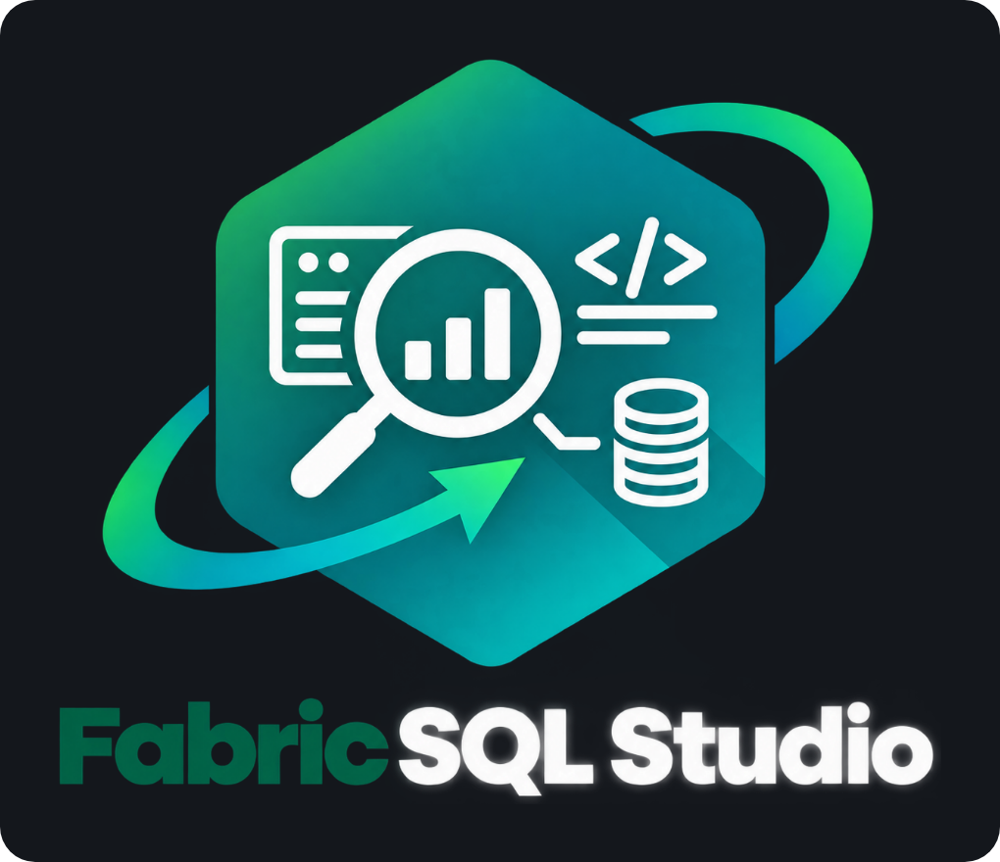
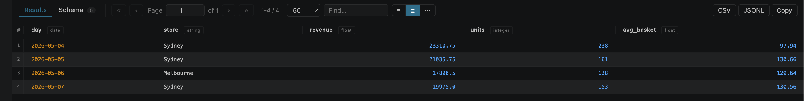
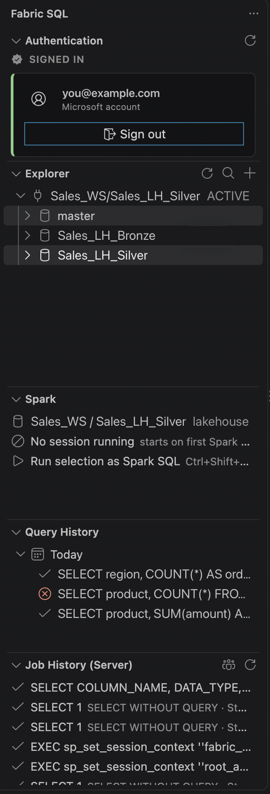
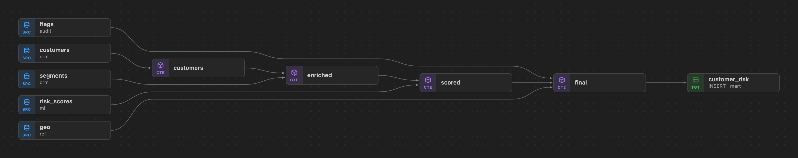
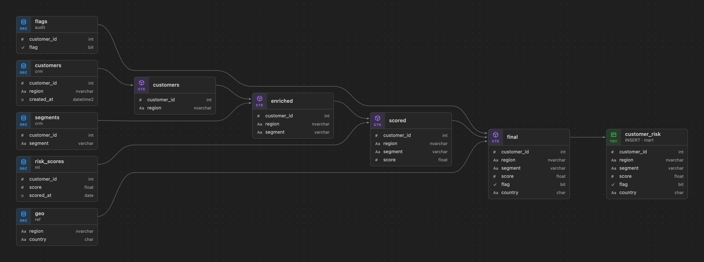
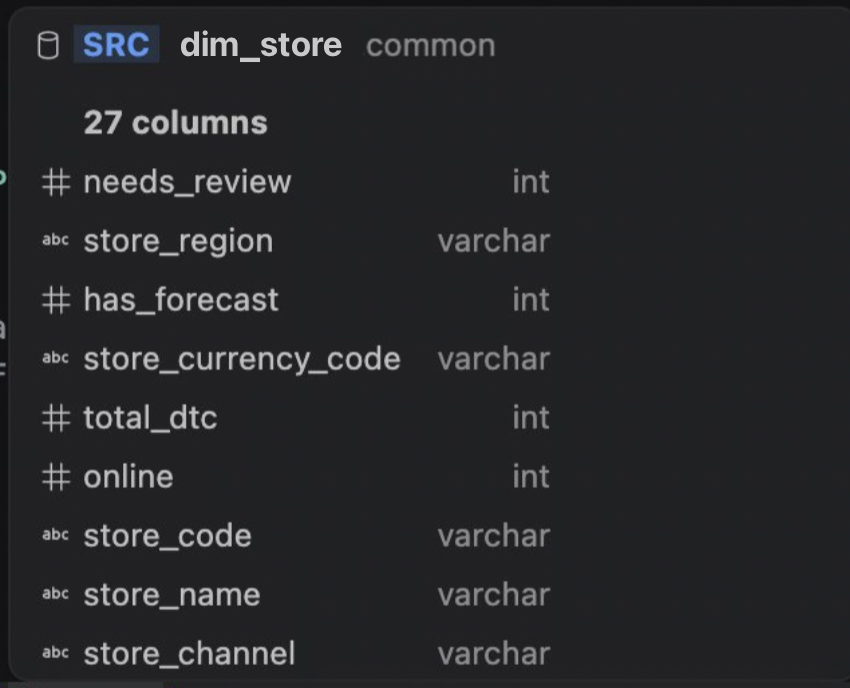

[](https://marketplace.visualstudio.com/items?itemName=s-seveur.fabric-sql-studio) [](https://marketplace.visualstudio.com/items?itemName=s-seveur.fabric-sql-studio) [](LICENSE)

Write and run T-SQL against Microsoft Fabric from VS Code. Sign in with your Microsoft account, pick a warehouse, lakehouse SQL endpoint or SQL database from your workspace, and query it. Azure SQL and SQL Server work the same way, and lakehouses can also be queried with Spark SQL.



## Connect

- **Sign in with Microsoft.** Use the Accounts menu in VS Code, or reuse an existing `az login`. There is no app registration to set up.
- **Add a Fabric connection in two clicks.** The `+` button in the explorer lists your workspaces, then the warehouses, lakehouse endpoints and SQL databases in the one you pick.
- **Queries go to the right place.** If a query names a database that lives on another connection, it runs there, and your active connection stays as it is.



The explorer shows each connection's databases, schemas, tables, views and routines. From any table you can preview the top 100 rows, see its schema, open a view's or procedure's definition, copy its full name, or pin it to the top.

## Run queries

- `Ctrl+Enter` runs the whole file. `Ctrl+E` runs only the selected text.
- A batch with several statements gives one result grid per statement. `INSERT`, `UPDATE` and `DELETE` show how many rows they changed.
- Errors appear on the line the server reported, like any other problem in the editor.
- The status bar shows the row count, the duration and which connection the query ran on.

The result grid sorts, searches, shows the schema of the result, and draws charts. Results export to CSV, JSONL or the clipboard. Up to 100,000 rows per result are kept (`fabricSql.maxRows`) and paged into the grid as you scroll.

**Spark SQL.** Pick a lakehouse with **Select Spark Lakehouse**, then press `Ctrl+Shift+Enter` to run the selection, or the whole file if nothing is selected. The query runs on a Livy session that stays open between runs, and the results land in the same grid. The Spark section of the sidebar shows the session's state and has a button to stop it.

**Notebooks.** Open a `.sql` or `.fsql` file as a notebook to run it cell by cell, each with its own results.

## Understand a query

**Data lineage.** Run **Fabric SQL: Show Data Lineage** from the editor title bar, or right-click a selection and choose **Show Data Lineage for Selection**, to see which tables a query reads, the CTEs in between, and what it writes to. Hovering a box highlights everything upstream and downstream of it. Clicking a box opens the SQL at that line. The graph exports to PNG or PDF.



Switch on **Columns** above the graph to list the columns of every table, CTE and result. Source and target tables are read from the catalog. CTE columns come from their `SELECT` list, and types follow the columns through the CTEs.



**Estimated plan.** **Fabric SQL: Show Estimated Plan** asks the server for its plan without running anything. It shows the operators as a tree with estimated rows and cost for each.

<!-- screenshot: images/plan.png (estimated plan panel) -->

**CTE preview.** Above every CTE there is a **Preview CTE** link that runs just that CTE (with the CTEs it depends on) and shows its first rows.

**Column profile.** Right-click a column name in your SQL and choose **Profile Column** to see its nulls, distinct values, min and max, quantiles and most common values.

## In the editor

- Completion for T-SQL keywords and functions, and for columns after `alias.` or `[db].[schema].[table].`
- Hover a table or a CTE to see its columns and their types.
- Formatting through `sql-formatter`'s T-SQL dialect, with options for keyword case, indentation and comma position.
- Syntax highlighting, folding and snippets.



## History

- **Query History** keeps everything you ran on this machine, so you can run it again or copy it.
- **Job History** lists recent requests on the server, from `queryinsights` on Fabric or `sys.dm_exec_requests` on SQL Server, with their timings.

## Getting started

1. Install the extension and open the **Fabric SQL** view in the activity bar.
2. Click **Sign in with Microsoft**.
3. Click `+` in the explorer and pick a workspace and an item. Or add a connection by hand in your settings:

   ```json
   "fabricSql.connections": [
     { "id": "gold-dev", "server": "<guid>.datawarehouse.fabric.microsoft.com", "database": "My_WH" },
     { "id": "onprem", "server": "sql01.corp.local", "port": 1433, "database": "Sales", "kind": "sqlserver" }
   ],
   "fabricSql.activeConnection": "gold-dev"
   ```

4. Open a `.sql` file and press `Ctrl+Enter`.

## Settings

All settings start with `fabricSql.`. The ones you are most likely to change:

| Setting | What it does |
|---|---|
| `connections`, `activeConnection` | Your connection profiles, and the one queries run on by default |
| `authMode`, `tenantId` | Sign in interactively (default) or through the Azure CLI; pin a tenant |
| `maxRows` | Rows kept per result (default 100,000) |
| `sparkLakehouse` | The lakehouse Spark SQL runs on |
| `ctePreviewRowLimit` | How many rows a CTE preview shows |
| `format*` | Formatter options: keyword case, indentation, commas, line width |
| `gridColors` | Cell colours per data type in the result grid |

## Privacy and security

- The extension collects no telemetry.
- It connects only to the SQL servers in your connections, to `api.fabric.microsoft.com` (to list workspaces and run Spark), and to Microsoft sign-in through VS Code.
- Your sign-in token is sent without asking only to Microsoft-hosted SQL servers (`*.fabric.microsoft.com`, `*.database.windows.net` and the like). Any other server, such as an on-premises SQL Server, asks for your permission once, and the answer is remembered on that machine.
- Tokens stay in the extension. The result grid, lineage and other panels never receive them.

## Requirements

- VS Code 1.82 or later
- Outbound TCP 1433 to your SQL endpoints
- For Fabric, access to the workspace: Viewer is enough to query, Contributor is needed for Job History

## Building from source

```bash
npm ci
npm run compile     # extension, result grid and notebook renderer
npm run test:unit
```

Press `F5` in VS Code to start a development window with the extension loaded.

## Credits

Fabric SQL Studio started as *BigQuery Studio*, itself a fork of [bstruct/vscode-bigquery](https://github.com/bstruct/vscode-bigquery). It has since been rewritten for Fabric and SQL Server, and no BigQuery code remains.

## License

[MIT](LICENSE)
